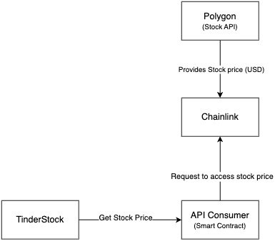
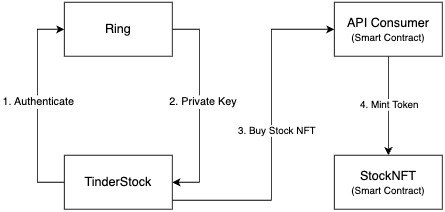

# NeuroSynapse

**NeuroSynapse** is an innovative Android application that allows users to buy U.S. stocks securely using blockchain technology. The app integrates advanced features such as NFC ring authentication and real-time stock pricing to ensure a smooth and safe user experience.

## Key Features

- **Blockchain-Backed Stock Purchases**: NeuroSynapse enables users to purchase U.S. stocks seamlessly using Ethereum blockchain technology.
  
- **Enhanced Security with NFC Ring**: The app leverages the **RingOFRingsSDK** to boost security by requiring confirmation via an NFC ring before completing any stock purchase.

- **Real-Time Stock Prices**: By integrating Chainlink technology, NeuroSynapse fetches real-time stock prices from the Ethereum blockchain, ensuring users have up-to-date information when making buying decisions.

- **NFT-Based Ownership**: After purchasing a stock, users receive an ERC-721 NFT in their wallet. This NFT represents the value of the stock, offering a unique and verifiable ownership mechanism on the blockchain.

## Technologies Used

- **Ethereum Blockchain**: For decentralized and secure stock transactions.
- **Chainlink**: For fetching real-time stock price data from external sources.
- **RingOFRingsSDK**: For NFC ring-based authentication, ensuring enhanced security for stock purchases.
- **ERC-721 NFTs**: To represent purchased stock as digital assets in the user's wallet.

## How We Fetch Stock Prices and Use Chainlink Oracles

To retrieve stock prices for our application, we utilize the Polygon API. Polygon is a Web 2 API that allows access to real-time and historical stock data. We use this API to gather accurate and up-to-date market information.

To securely connect this data with our smart contracts, we leverage Chainlink Oracles. Chainlink provides a decentralized infrastructure that allows us to fetch data from Web 2 APIs and deliver it to blockchain-based smart contracts. By doing so, we can ensure the integrity and reliability of the data without relying on a single centralized source.

- **Polygon API Documentation:**: https://polygon.io/docs/stocks/getting-started
- **Chainlink Oracles Documentation:**: https://docs.chain.link/any-api/get-request/examples/single-word-response/

## TinderStock Diagrams

### StockAPI

### StockNFT
